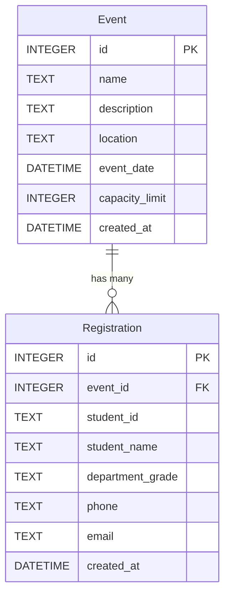

# 資料庫設計文件 (DB DESIGN)：大學生校園活動報名系統

本文件根據 PRD 與 FLOWCHART 所定義的使用者需求，進一步詳細規劃我們的 SQLite 關聯式資料庫架構與表格。

## 1. ER 圖 (實體關係圖)

本系統僅需兩個核心實體：`Event` (活動) 與 `Registration` (報名紀錄)，兩者呈現**一對多 (One-to-Many)** 的層級關聯。

## 2. 資料表詳細說明

### 2.1 Event (活動表)
儲存主辦方所建立的活動基礎設定與限制資訊。

| 欄位名稱 (Column) | 資料型別 (Type) | 說明與約束 |
| :--- | :--- | :--- |
| `id` | INTEGER | Primary Key, 自動遞增。 |
| `name` | TEXT | 活動的公開名稱，**必填**。 |
| `description` | TEXT | 活動簡介與注意事項摘要，非必填。 |
| `location` | TEXT | 舉辦地點實體位置或線上連結，**必填**。 |
| `event_date` | DATETIME | 活動舉辦的日期與時間，**必填**。 |
| `capacity_limit` | INTEGER | **報名人數上限**，用作防呆門檻，**必填**。 |
| `created_at` | DATETIME | 系統自動產生，活動建立的時間，預設為當前時間。 |

### 2.2 Registration (報名紀錄表)
儲存學生的報名資料，與 `Event` 進行綁定。

| 欄位名稱 (Column) | 資料型別 (Type) | 說明與約束 |
| :--- | :--- | :--- |
| `id` | INTEGER | Primary Key, 自動遞增。 |
| `event_id` | INTEGER | Foreign Key，關聯至 `Event.id`，**必填**。 |
| `student_id` | TEXT | 學生學號 (作為系統唯一門票/識別碼)，**必填**。 |
| `student_name`| TEXT | 學生真實姓名，**必填**。 |
| `department_grade`| TEXT | 就讀系所與年級，**必填**。 |
| `phone` | TEXT | 聯絡用手機號碼，**必填**。 |
| `email` | TEXT | 聯絡用電子信箱，**必填**。 |
| `created_at` | DATETIME | 系統自動產生，學生送出報名的時間，預設為當前時間。 |

> **提示**：目前 `Registration` 沒有限制同一個學號必不能重複報名，這是因為在某些場景可能需要替別人代報。但如果校方的嚴格程度較高，可考慮在未來加入 `UNIQUE(event_id, student_id)` 約束來杜絕重複學號提交。

## 3. SQL 建表語法
為方便未來匯入，我們將完整的 CREATE TABLE SQLite 語法儲存於 `database/schema.sql`，您可直接執行該腳本。

## 4. Python Model 程式碼
因為架構設計選用了 SQLAlchemy ORM 進行操作開發，我們同步產出了對應的 Pydantic/SQLAlchemy model 封裝，放置於 `app/models/models.py` 讓 Controller 呼叫。
