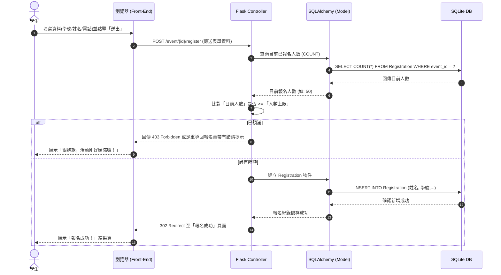

# 流程圖文件 (FLOWCHART)：大學生校園活動報名系統

本文件基於 PRD 與系統架構設計，視覺化描述「使用者（學生與主辦方）的操作路徑」以及「系統內部的資料互動順序」。

---

## 1. 使用者流程圖 (User Flow)

此流程圖區分了「前台（學生）」與「後台（主辦方管理者）」的操作動線，涵蓋了活動報名的建立與送出流程。

```mermaid
flowchart LR
    %% 角色節點設定
    subgraph Admin_Flow [主辦方後台流程]
        A1([主辦方登入系統]) --> A2[後台控制中心 Admin Dashboard]
        A2 --> A3{選擇管理項目}
        
        A3 -->|新增| A4[填寫活動資訊 & 人數上限]
        A4 --> A5[產生活動專屬報名連結]
        
        A3 -->|檢視活動| A6[檢視單一活動狀態與報名清單]
        A6 --> A7[匯出名單 Excel/CSV]
        A6 --> A8[手動提早關閉報名]
    end

    subgraph User_Flow [學生前台報名流程]
        U1([學生點擊報名連結]) --> U2[進入活動詳情頁面]
        U2 --> U3{檢查是否額滿？}
        
        U3 -->|是 (已達人數上限)| U4[報名按鈕反灰]
        U4 --> U5[顯示「已額滿」提示]
        
        U3 -->|否 (尚有名額)| U6[填寫報名資料]
        U6 --> U7[送出表單 (POST)]
        U7 --> U8[顯示「報名成功」提示頁面]
    end
```

---

## 2. 系統序列圖 (System Sequence Diagram)

以下序列圖描述最核心的商業邏輯：**「學生填寫表單並送出報名」** 到 **「資料存入資料庫」** 的完整系統防呆與寫入流程。



---

## 3. 功能清單與 API 對照表

以下為本 MVP 專案的重要頁面與路徑（Route）規劃清單，以對應上述的流程圖：

| 功能區域 | 操作行為 | URL 路徑 (Routes) | HTTP Method | 說明 |
| :--- | :--- | :--- | :---: | :--- |
| **前台 (學生)** | 活動列表 | `/` | GET | 若有需要，展示列出所有開放中活動 |
| **前台 (學生)** | 活動詳情/報名表 | `/event/<int:event_id>` | GET | 學生填寫報名資料的頁面 (含剩餘人數顯示) |
| **前台 (學生)** | 送出報名資料 | `/event/<int:event_id>/register` | POST | 接收表單、檢查額滿狀態，成功則寫入 DB |
| **前台 (學生)** | 報名成功頁面 | `/event/<int:event_id>/success` | GET | 顯示大大的成功提示供學生截圖 |
| **後台 (主辦)** | 中央控制台 | `/admin` | GET | 列出該主辦方的所有活動 |
| **後台 (主辦)** | 建立新活動 | `/admin/event/new` | GET / POST | 填寫/送出活動基本資料與人數上限 |
| **後台 (主辦)** | 檢視報名清單 | `/admin/event/<int:event_id>/registrations` | GET | 表格化列出所有報名學生的詳細資料 |
| **後台 (主辦)** | 匯出報名名單 | `/admin/event/<int:event_id>/export` | GET | 觸發下載 CSV/Excel 檔案 |
